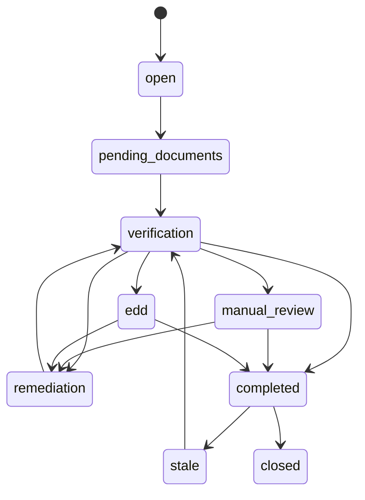
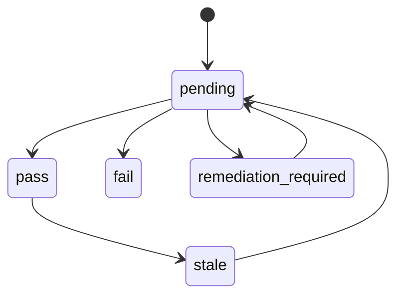
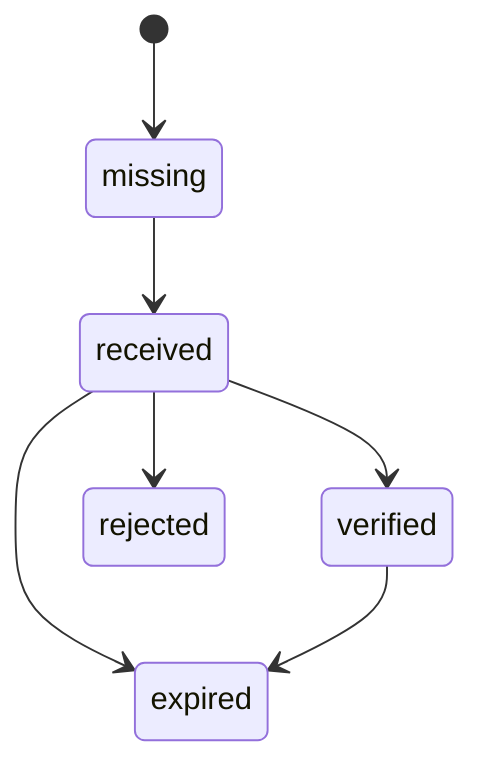
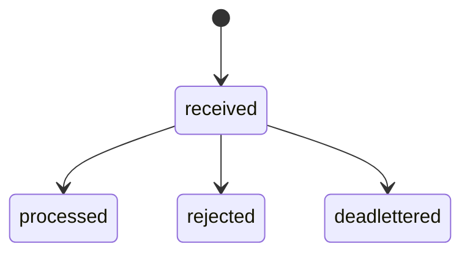
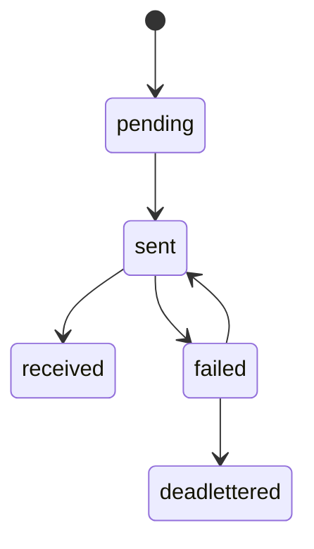

# KYC-01 KYC / KYB Verification
## 06 State Machine

## 1. KYC Case State

```mermaid
stateDiagram-v2
  [*] --> open
  open --> pending_documents
  pending_documents --> verification
  verification --> manual_review
  verification --> edd
  verification --> remediation
  verification --> completed
  manual_review --> completed
  manual_review --> remediation
  edd --> completed
  edd --> remediation
  remediation --> verification
  completed --> stale
  stale --> verification
  completed --> closed
```

## 2. CDD Outcome State

```mermaid
stateDiagram-v2
  [*] --> pending
  pending --> pass
  pending --> fail
  pending --> remediation_required
  pass --> stale
  remediation_required --> pending
  stale --> pending
```

## 3. Document State

```mermaid
stateDiagram-v2
  [*] --> missing
  missing --> received
  received --> verified
  received --> rejected
  received --> expired
  verified --> expired
```

## 4. Vendor Result State

```mermaid
stateDiagram-v2
  [*] --> received
  received --> processed
  received --> rejected
  received --> deadlettered
```

## 5. Outcome Publication State

```mermaid
stateDiagram-v2
  [*] --> pending
  pending --> sent
  sent --> received
  sent --> failed
  failed --> sent
  failed --> deadlettered
```
