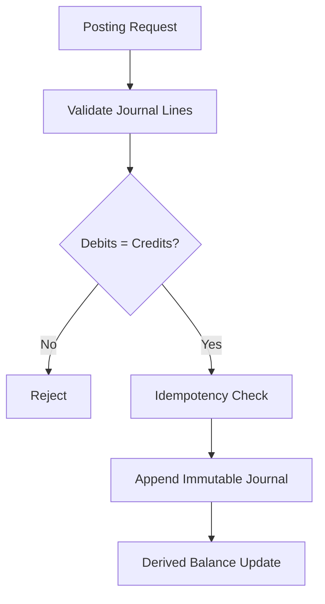
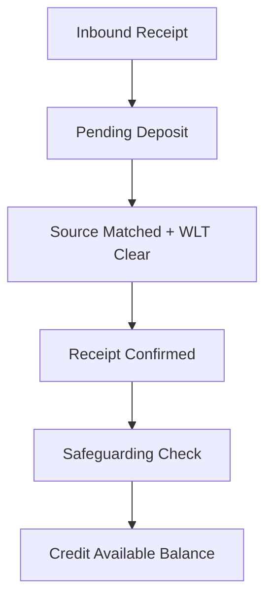
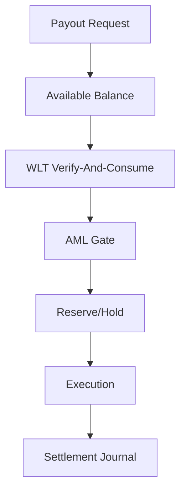
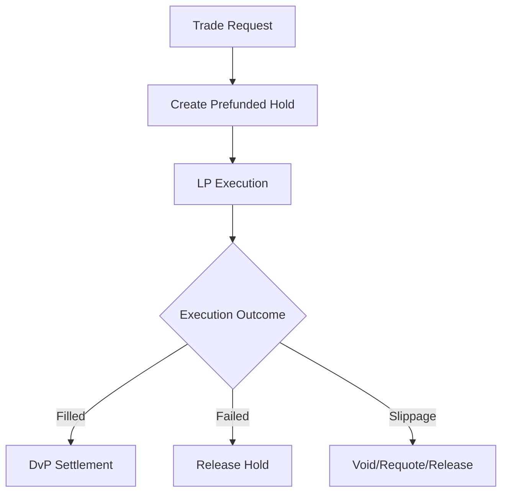
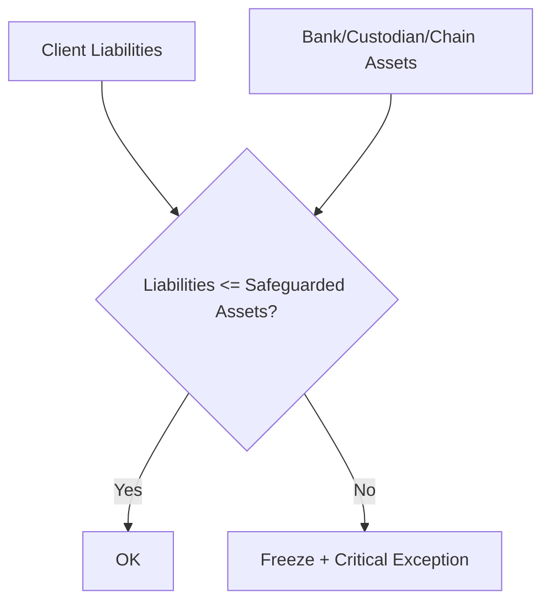

# LED-01 Ledger / Settlement / Safeguarding
## 03 Diagrams

## 1. Double-Entry Posting

---

## 2. Deposit Credit

---

## 3. Withdrawal / Payout

---

## 4. Prefunded Hold / LP Execution

---

## 5. Safeguarding Invariant

