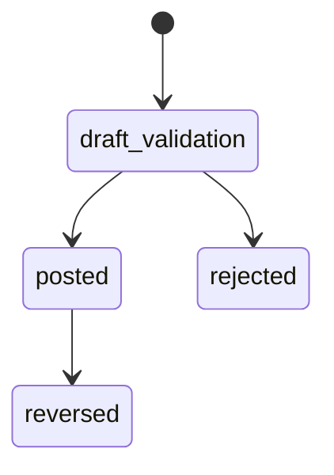
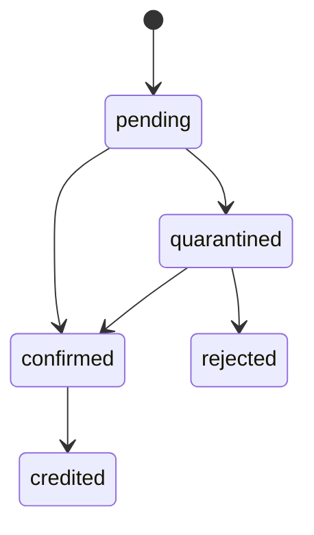
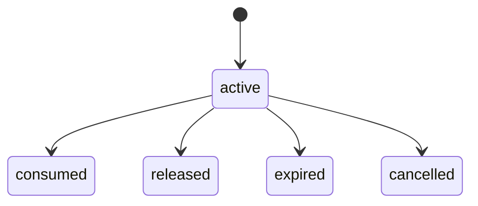
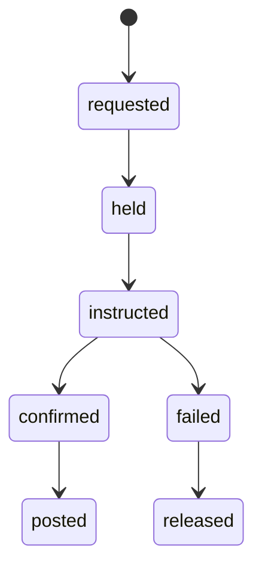
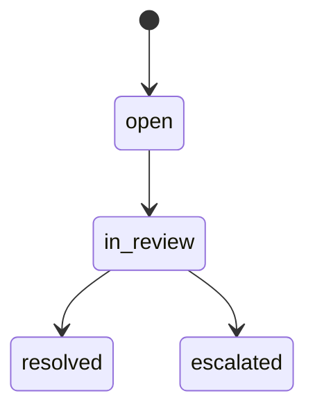
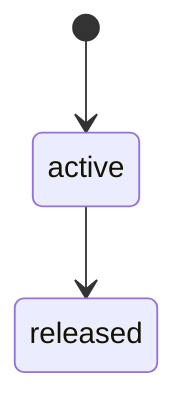

# LED-01 Ledger / Settlement / Safeguarding
## 06 State Machine

## 1. Journal State

## 2. Deposit State

## 3. Hold State

## 4. Settlement State

## 5. Reconciliation Break State

## 6. Freeze State

