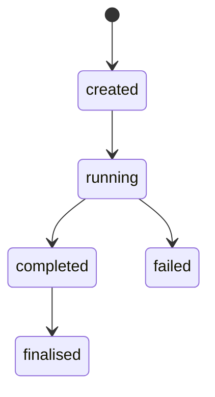
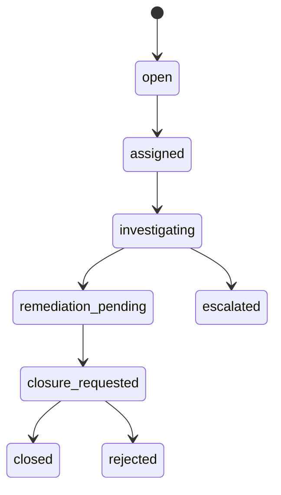
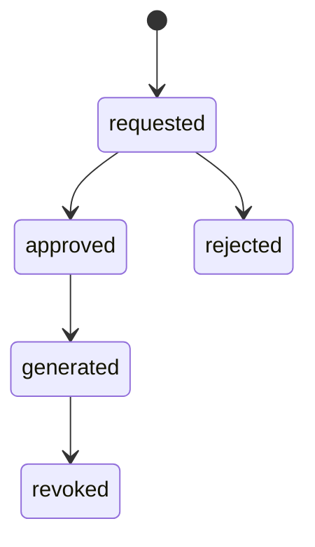
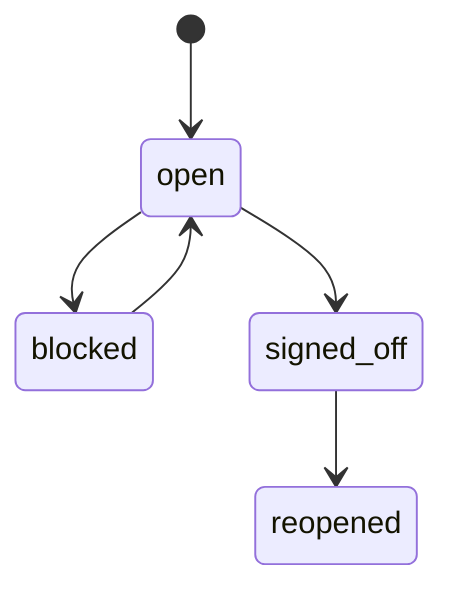
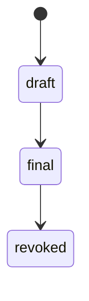

# REC-01 Reconciliation / Finance Reporting
## 06 State Machine

## 1. Reconciliation Run State

```mermaid
stateDiagram-v2
  [*] --> created
  created --> running
  running --> completed
  running --> failed
  completed --> finalised
```

## 2. Break State

```mermaid
stateDiagram-v2
  [*] --> open
  open --> assigned
  assigned --> investigating
  investigating --> remediation_pending
  remediation_pending --> closure_requested
  closure_requested --> closed
  closure_requested --> rejected
  investigating --> escalated
```

## 3. Evidence Pack State

```mermaid
stateDiagram-v2
  [*] --> requested
  requested --> approved
  requested --> rejected
  approved --> generated
  generated --> revoked
```

## 4. Daily Close State

```mermaid
stateDiagram-v2
  [*] --> open
  open --> blocked
  open --> signed_off
  blocked --> open
  signed_off --> reopened
```

## 5. Report State

```mermaid
stateDiagram-v2
  [*] --> draft
  draft --> final
  final --> revoked
```
