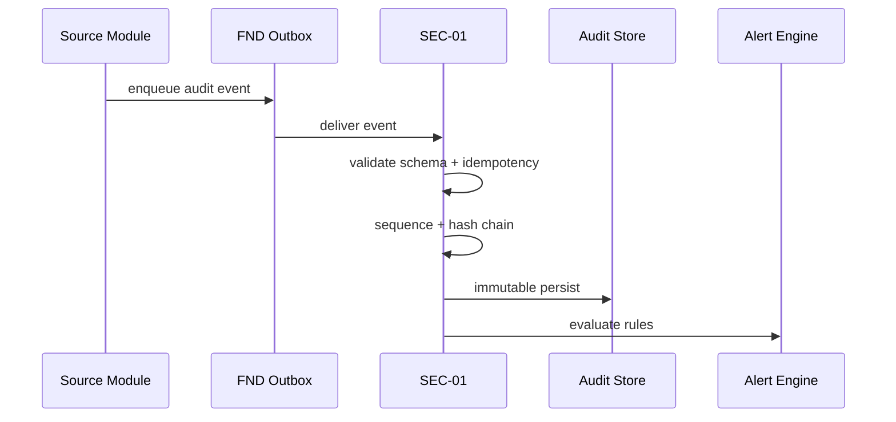
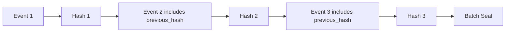
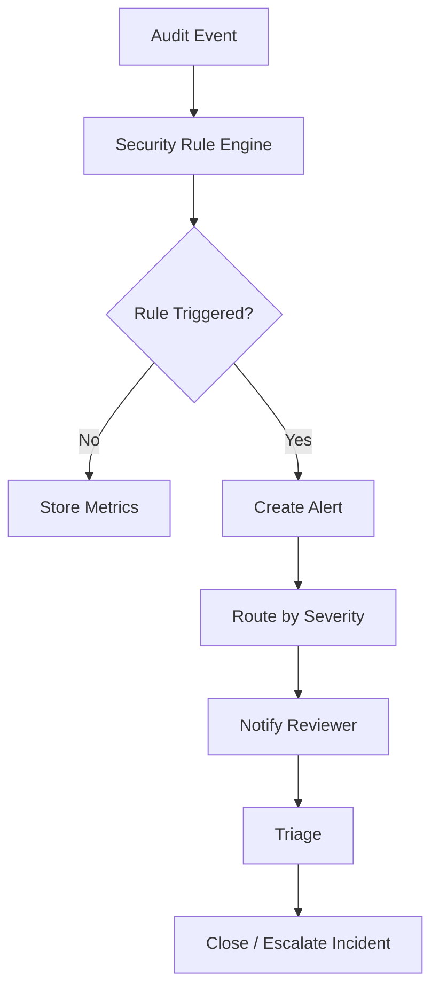
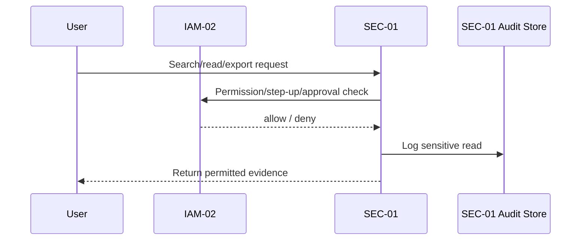
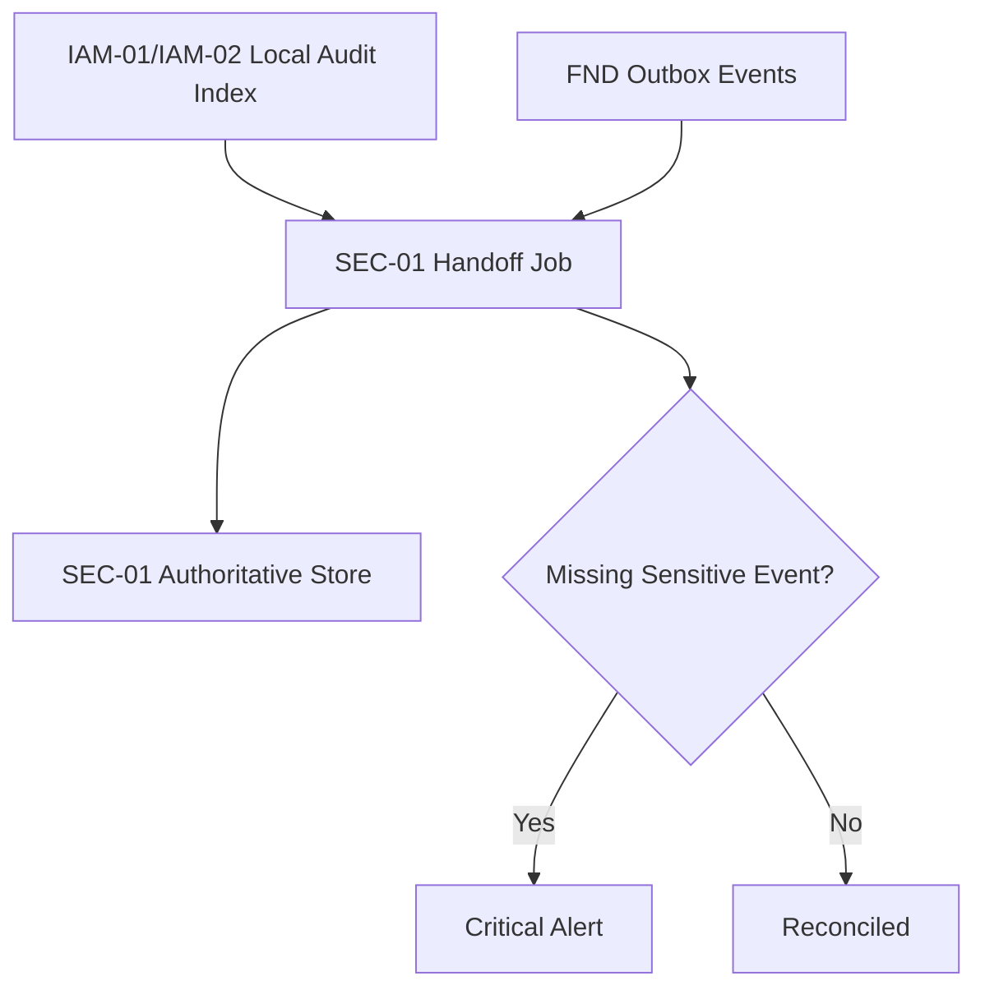
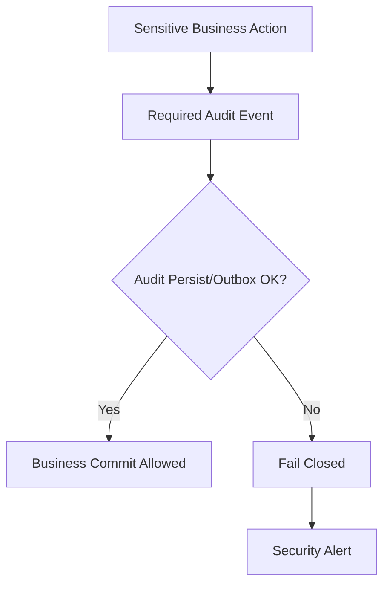

# SEC-01 Audit Log / Security Monitoring  
## 03 Diagrams

## 1. Audit Event Ingestion

---

## 2. Hash Chain

---

## 3. Security Monitoring

---

## 4. Sensitive Audit Read

---

## 5. Interim Audit Handoff

---

## 6. Audit Failure Fail-Closed

