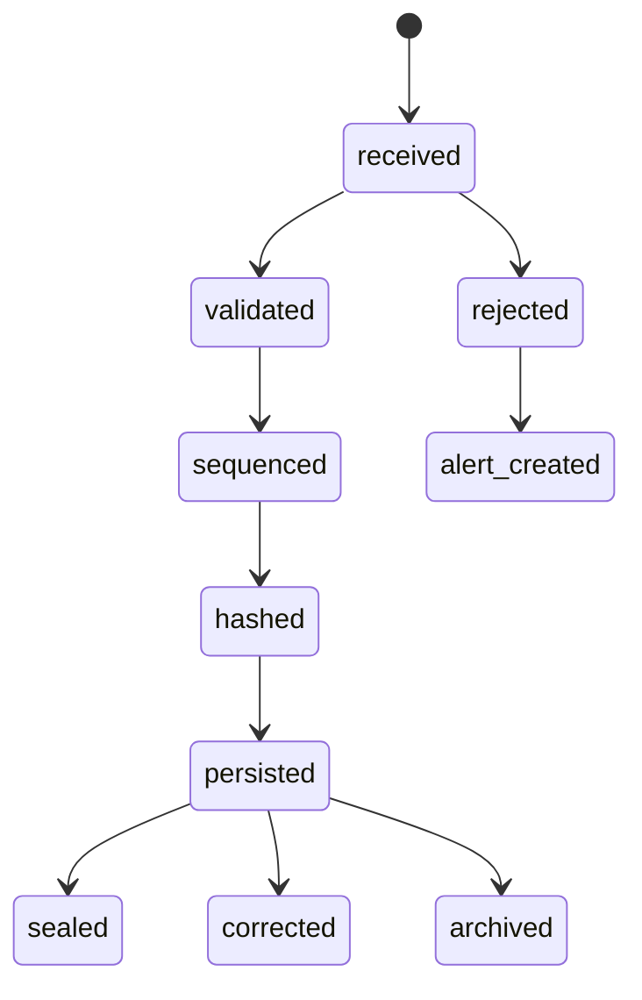
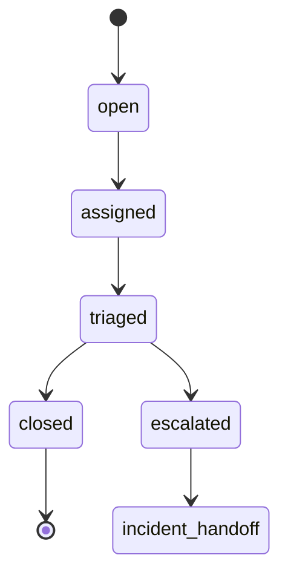
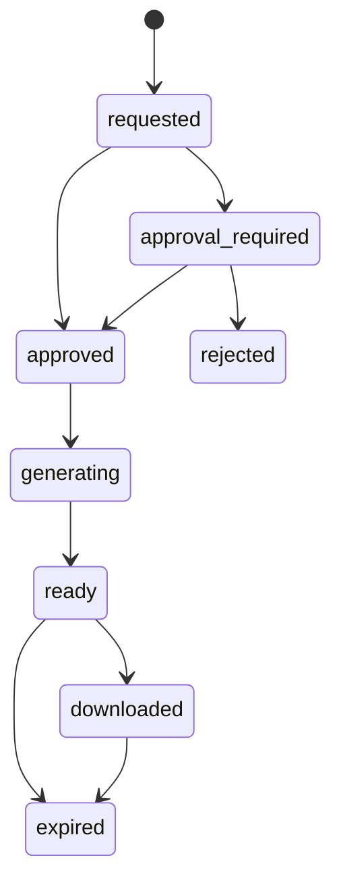
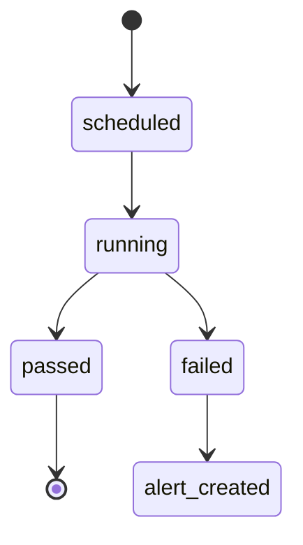
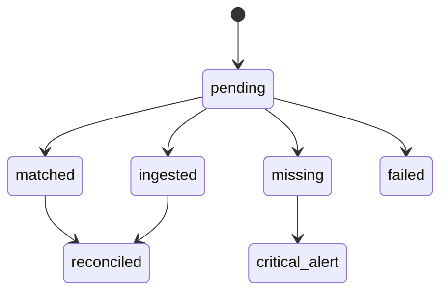

# SEC-01 Audit Log / Security Monitoring  
## 06 State Machine

## 1. Audit Event State

## 2. Security Alert State

## 3. Evidence Export State

## 4. Integrity Verification State

## 5. Interim Audit Handoff State

