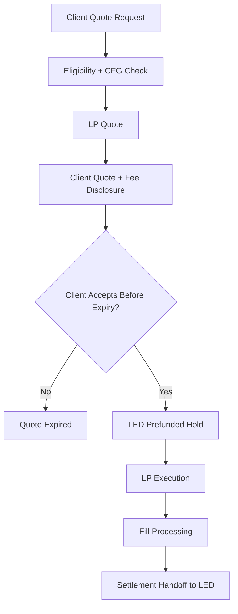
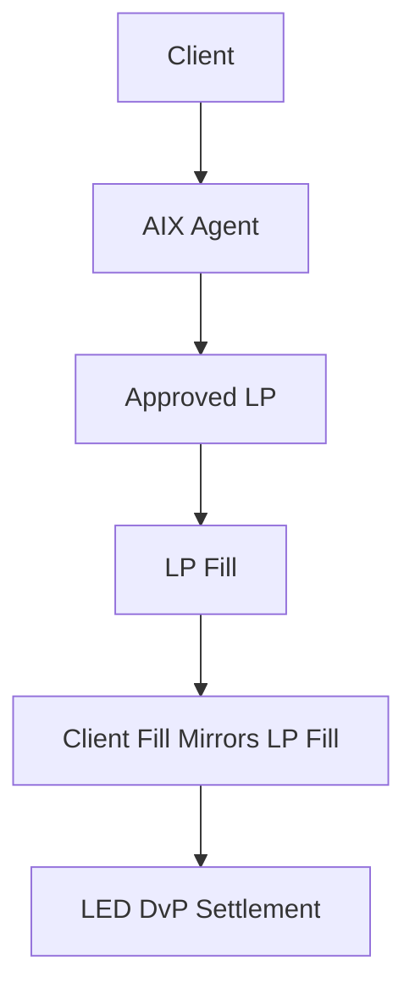
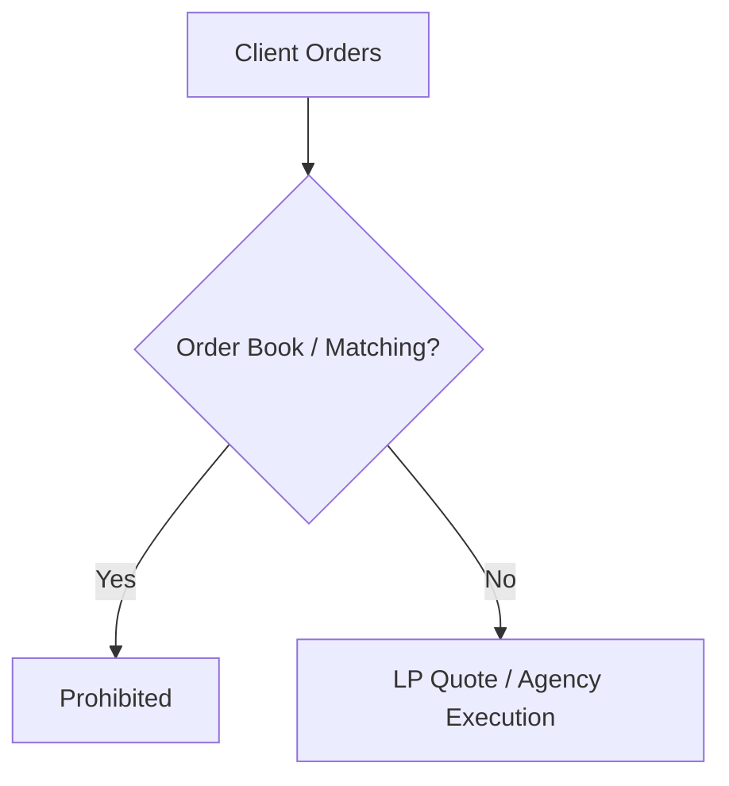
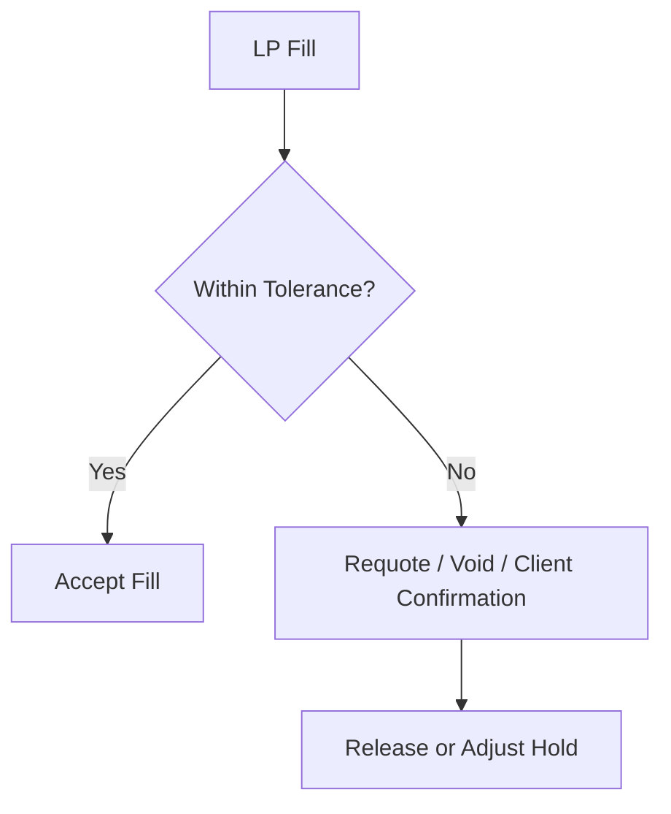
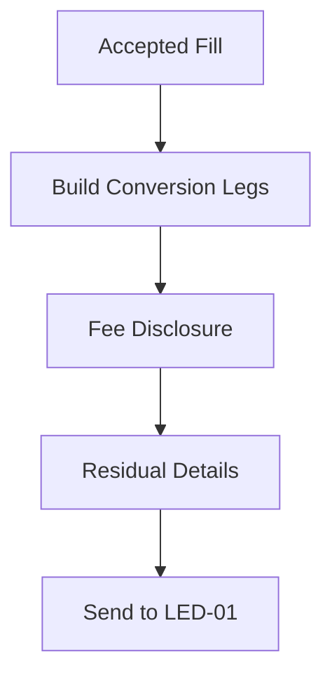

# TRD-01 Quote / Trade / LP Execution
## 03 Diagrams

## 1. Quote and Execution Flow

---

## 2. Agency / Back-to-Back

---

## 3. Prohibited Exchange Features

---

## 4. Slippage Handling

---

## 5. Settlement Handoff

