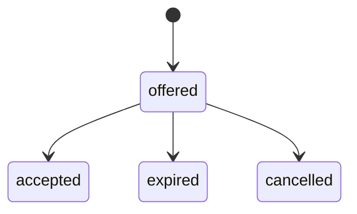
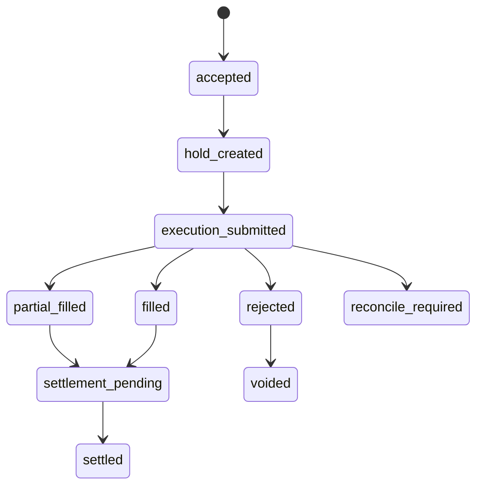
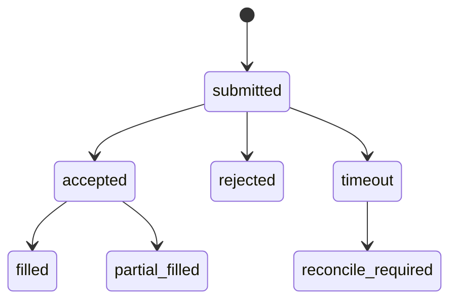
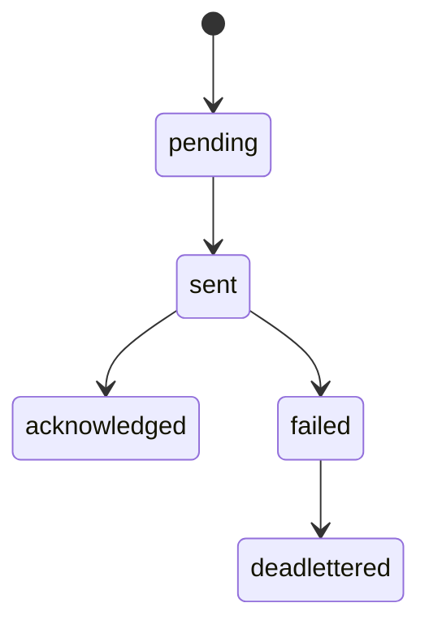
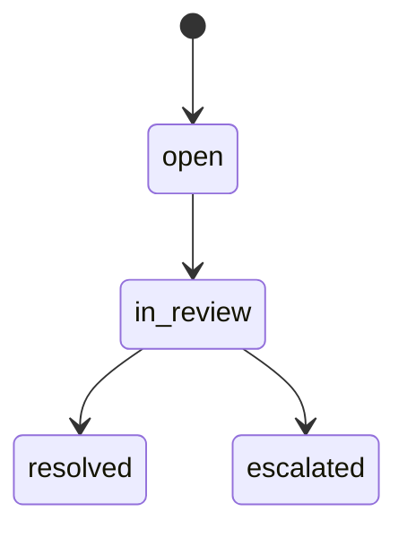

# TRD-01 Quote / Trade / LP Execution
## 06 State Machine

## 1. Quote State

```mermaid
stateDiagram-v2
  [*] --> offered
  offered --> accepted
  offered --> expired
  offered --> cancelled
```

## 2. Trade State

```mermaid
stateDiagram-v2
  [*] --> accepted
  accepted --> hold_created
  hold_created --> execution_submitted
  execution_submitted --> filled
  execution_submitted --> partial_filled
  execution_submitted --> rejected
  execution_submitted --> reconcile_required
  partial_filled --> settlement_pending
  filled --> settlement_pending
  settlement_pending --> settled
  rejected --> voided
```

## 3. LP Order State

```mermaid
stateDiagram-v2
  [*] --> submitted
  submitted --> accepted
  accepted --> filled
  accepted --> partial_filled
  submitted --> rejected
  submitted --> timeout
  timeout --> reconcile_required
```

## 4. Settlement Handoff State

```mermaid
stateDiagram-v2
  [*] --> pending
  pending --> sent
  sent --> acknowledged
  sent --> failed
  failed --> deadlettered
```

## 5. Reconciliation Break State

```mermaid
stateDiagram-v2
  [*] --> open
  open --> in_review
  in_review --> resolved
  in_review --> escalated
```
