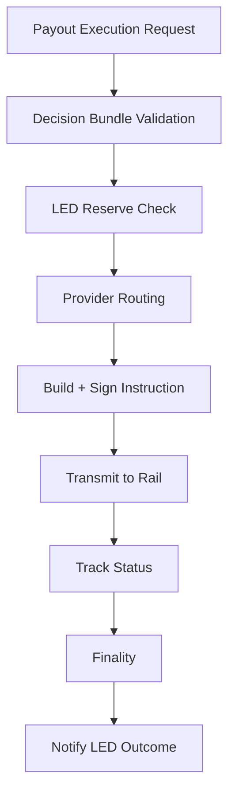
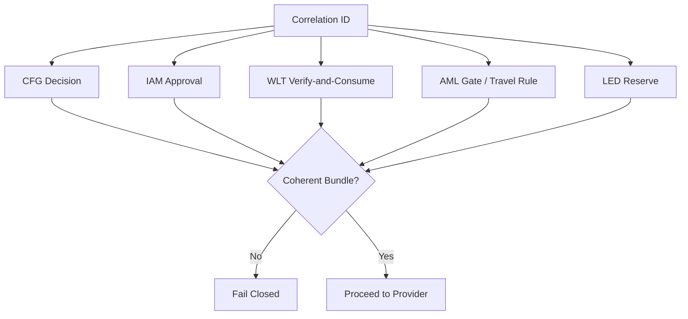
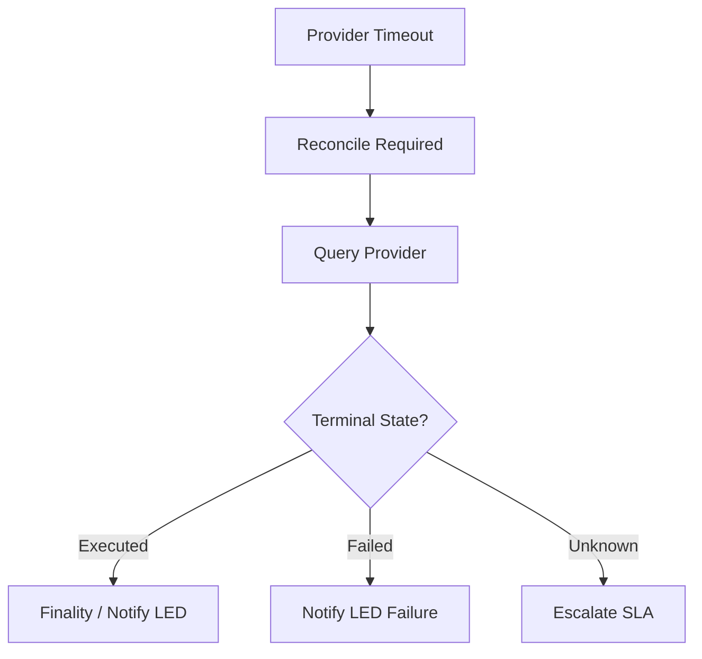
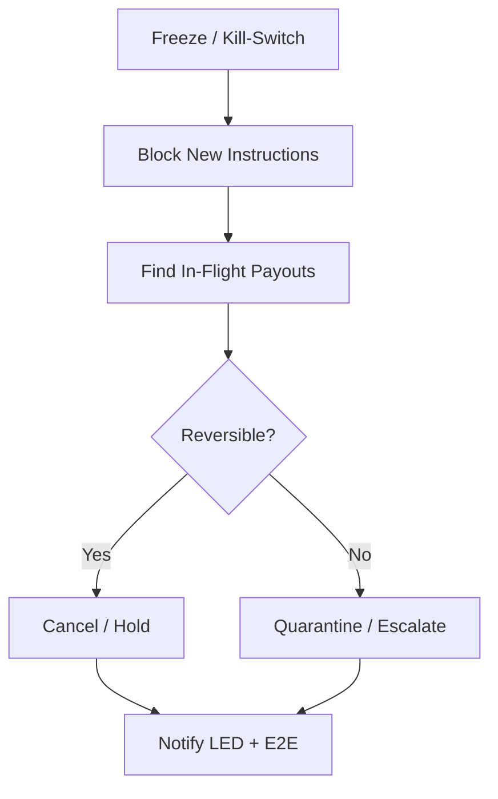

# WDR-01 Withdrawal / Payout Execution Rail
## 03 Diagrams

## 1. Payout Execution Flow

```mermaid
flowchart TD
  A[Payout Execution Request] --> B[Decision Bundle Validation]
  B --> C[LED Reserve Check]
  C --> D[Provider Routing]
  D --> E[Build + Sign Instruction]
  E --> F[Transmit to Rail]
  F --> G[Track Status]
  G --> H[Finality]
  H --> I[Notify LED Outcome]
```

## 2. Decision Bundle

```mermaid
flowchart TD
  A[Correlation ID] --> B[CFG Decision]
  A --> C[IAM Approval]
  A --> D[WLT Verify-and-Consume]
  A --> E[AML Gate / Travel Rule]
  A --> F[LED Reserve]
  B --> G{Coherent Bundle?}
  C --> G
  D --> G
  E --> G
  F --> G
  G -->|No| H[Fail Closed]
  G -->|Yes| I[Proceed to Provider]
```

## 3. Timeout Query-Back

```mermaid
flowchart TD
  A[Provider Timeout] --> B[Reconcile Required]
  B --> C[Query Provider]
  C --> D{Terminal State?}
  D -->|Executed| E[Finality / Notify LED]
  D -->|Failed| F[Notify LED Failure]
  D -->|Unknown| G[Escalate SLA]
```

## 4. Freeze Handling

```mermaid
flowchart TD
  A[Freeze / Kill-Switch] --> B[Block New Instructions]
  B --> C[Find In-Flight Payouts]
  C --> D{Reversible?}
  D -->|Yes| E[Cancel / Hold]
  D -->|No| F[Quarantine / Escalate]
  E --> G[Notify LED + E2E]
  F --> G
```
