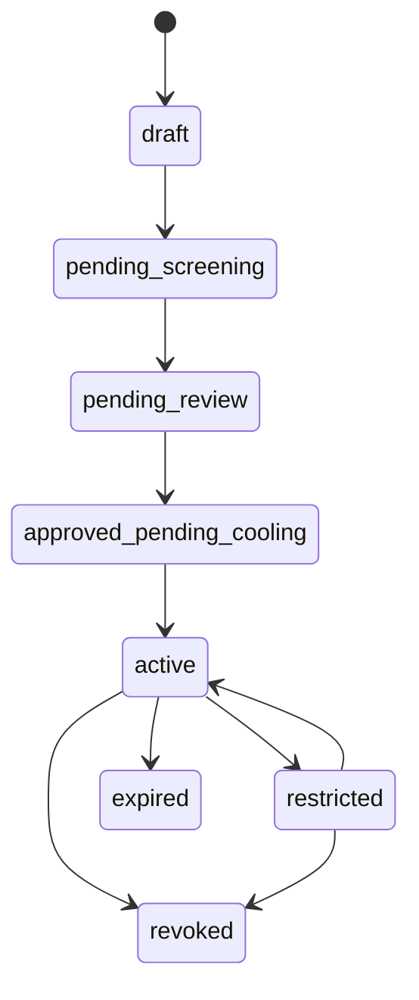
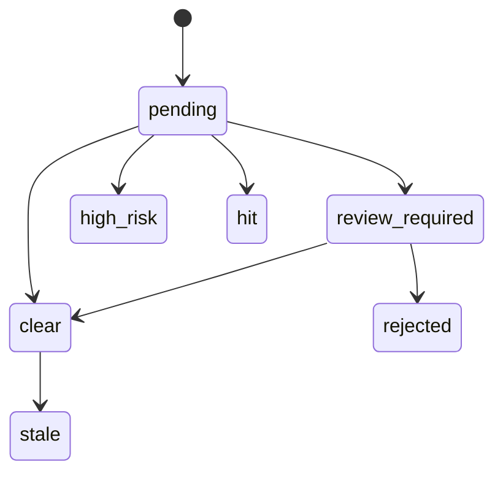
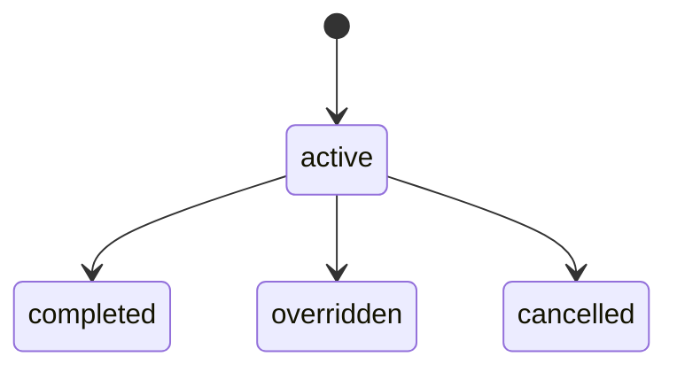
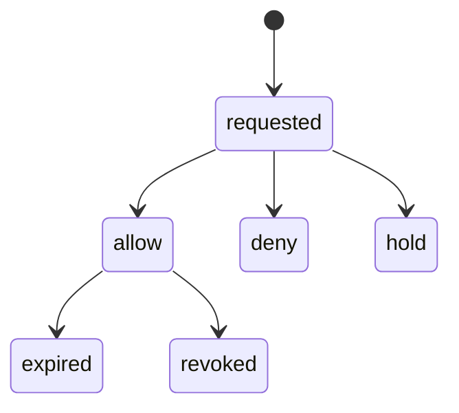
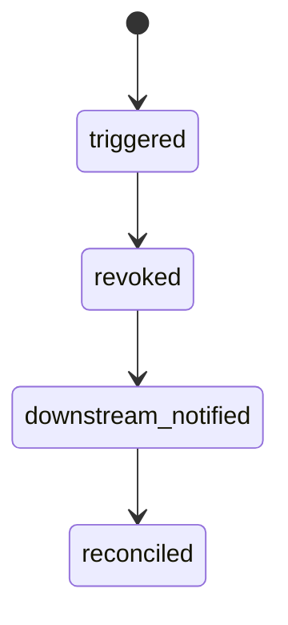

# WLT-01 Wallet Screening / Payout Destination Whitelist
## 06 State Machine

## 1. Destination State

## 2. Wallet Screening State

## 3. Cooling-Off State

## 4. Destination Decision State

## 5. Revocation State

